```{r setup, include=FALSE}
options(htmltools.dir.version = FALSE)
```


```{r xaringan-themer, include=FALSE, warning=FALSE}
library(xaringanthemer)
library(xaringanExtra)
library(tidyverse)
library(knitr)
#library(icon)
library(nomnoml)
#library(countdown)
# xaringanExtra::use_logo(
#   image_url = "https://raw.githubusercontent.com/rstudio/hex-stickers/master/PNG/xaringan.png"
# )
xaringanExtra::use_panelset()
xaringanExtra::use_broadcast()
xaringanExtra::use_share_again()
xaringanExtra::style_share_again(share_buttons = c("twitter", "linkedin"))
xaringanExtra::use_tachyons()
xaringanExtra::use_fit_screen()
xaringanExtra::use_tile_view() # O
xaringanExtra::use_scribble()
style_mono_accent(
  base_color = "#af2433",
  background_color = "#ffffff",
  inverse_background_color = "#af2433",
  header_color = "#af2433",
  inverse_header_color = "#ffffff", 
  inverse_text_color = "#ffffff",
  code_inline_color = "#af2433",
  link_color= "#af2433",
  footnote_color =  "#af2433",
  text_font_size = "30px",
  header_font_google = google_font("Times", "Regular", "500"),
  text_font_google   = google_font("Darker Grotesque", "500"),
  code_font_google   = google_font("Fira Mono"),
  code_font_size   = "20px"
)
require(kableExtra,quietly=TRUE)
require(tidyverse,quietly=TRUE)
require(lubridate,quietly=TRUE)
require(plotly,quietly=TRUE)
require(scales,quietly=TRUE)
```


class: center, middle


#  Point Process Analysis


### Ignacio Sarmiento-Barbieri


---
# Tipos de Datos Espaciales

Los datos espaciales vienen en muchas "formas" y "tamaños", los tipos más comunes de datos espaciales son:

- **Punto**

- **Líneas**

- **Polígonos**

- **Grillas (*o raster*)**


---
# The earth ain't flat


```{r , echo = FALSE, out.width=800, fig.align='center'}
  knitr::include_graphics("figures/world-1.png")
```


---
# Projections

 -  Geographic coordinate systems: coordinate systems that span the entire globe (e.g. latitude / longitude).
  
  - Projected coordinate systems: coordinate systems that are localized to minimize visual distortion in a particular region (e.g. Robinson, UTM, State Plane)
  
---
# Projections

```{r , echo = FALSE, out.width=800, fig.align='center'}
  knitr::include_graphics("figures/proj.png")
```
---
# Which projection should I choose?
- “There exist no all-purpose projections, all involve distortion when far from the center of the specified frame” (Bivand, Pebesma, and Gómez-Rubio 2013)
  
  - In some cases, it is not something that we are free to decide: “often the choice of projection is made by a public mapping agency” (Bivand, Pebesma, and Gómez-Rubio 2013).

  -  This means that when working with local data sources, it is likely preferable to work with the CRS in which the data was provided.

  - For Bogotá the IGAC promotes the adoption of MAGNA-SIRGAS. EPSG code: 4626

---
## Reading Spatial Data in R

Packages:

```{r}

require("sf")
require("tidyverse")
require("here")

```

---
## Reading Spatial Data in R

```{r}
bars<-st_read(here("egba/EGBa.shp"))

```
---
## Visualizing Points

.pull-left[
```{r plot_bars, eval=FALSE, cache=TRUE}

ggplot()+
  geom_sf(data=bars) +
  theme_bw() +
  theme(axis.title =element_blank(),
        panel.grid.major = element_blank(),
        panel.grid.minor = element_blank(),
        axis.text = element_text(size=6))
```
]

.pull-right[
```{r plot_bars, ref.label="plot_bars", echo=FALSE, cache=TRUE}
```
]

---
class: center, middle


#  Point Process Methods
---
#  Questions

- Are the points spread uniformly over the survey region? 

- Are the points randomly scattered? 

- Is there evidence of clustering? 

- Does the density of points depend on an explanatory variable? 

--

To give a sensible answer we must recognise that these questions are not about the points themselves, but about the way the points were generated.
---

```{r , echo = FALSE, out.width=900,out.height=600, fig.align='center'}
  knitr::include_graphics("figures/point_realizations.png")
```
---
# Point Process and Notation

```{r , echo = FALSE,out.width=400, out.height=400, fig.align='center'}
  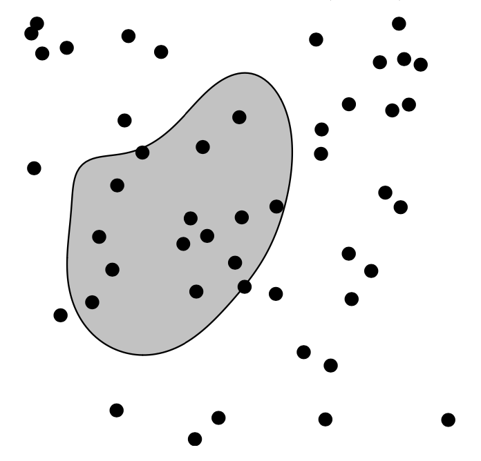
```

---
# Complete spatial randomness (CSR)

Properties:

- homogeneity

- independence

---
# CSR: homogeneity

```{r , echo = FALSE, out.height=400, fig.align='center'}
  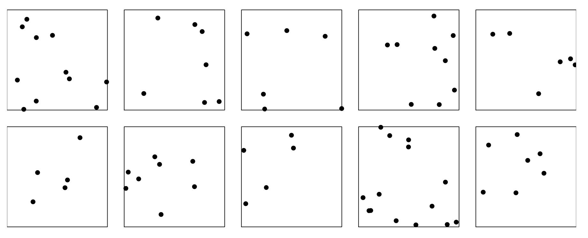
```


---
# CSR: independence

```{r , echo = FALSE, out.height=400, fig.align='center'}
  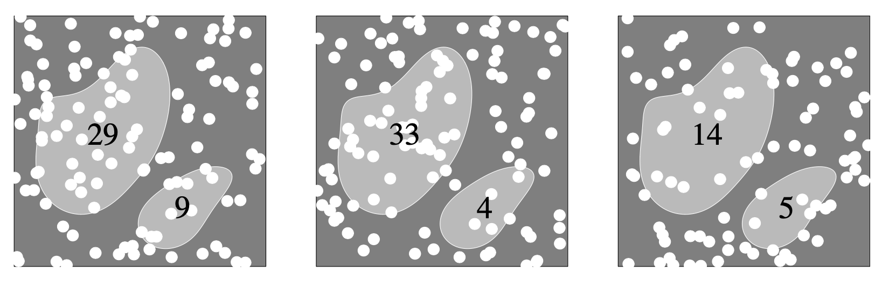
```

---
# Simulation of CSR

```{r }
require("spatstat")
```


---
class: center
# Simulation of CSR

```{r }
set.seed(10101)
plot(rpoispp(50))
```


---
class: center
# Simulation of CSR

```{r }
plot(rpoispp(100,nsim=6))
```
---
# Inhomogeneous Poisson process

.pull-left[
```{r}
lambda <- function(x,y) { 100 * (x^2+y) } 
X <- rpoispp(lambda, win=square(1))
```
]
.pull-right[
```{r}
plot(X)
```
]
---


class: center, middle


#  Exploratory Data Analysis
---
# Intensity

```{r}
plot(swedishpines, main = "")
```
---
# Intensity

```{r}
npoints(swedishpines)/area(Window(swedishpines))
```

```{r}
intensity(swedishpines)
```

```{r}
unitname(swedishpines)
```

---
# Estimating Homogeneous Intensity

```{r}
summary(swedishpines)
```


---
# Estimating Homogeneous Intensity


```{r}
intensity(rescale(swedishpines))
```

---
# Estimating Homogeneous Intensity

```{r}
X <- rescale(swedishpines)
lam <- intensity(X)
(sdX <- sqrt(lam/area(Window(X))))
```

---
# Quadrant Counting


```{r}
swp <- rescale(swedishpines)
Q3 <- quadratcount(swp, nx=3, ny=3)
Q3
```

---
# Quadrant Counting


```{r echo=FALSE}
Q3plus <- layered(Q3, swp, 
                  plotargs=list(list(cex=2), list(pch="+")))
L3 <- intensity(Q3, image=TRUE)

pa <- function(i) { if(i == 1) list() else list(box=TRUE, ribargs=list(las=1)) }
plot(solist(Q3plus, L3), main="", main.panel="", mar.panel=0, hsep=1,
     panel.args=pa, equal.scales=TRUE)
```


---
# Quadrant Counting test for homogeneity

```{r}
intensity(Q3)
```

---
# Quadrant Counting test for homogeneity

```{r}
tS <- quadrat.test(swp, 3,3)
tS
```

```{r}
tS$p.value
```

---
# Quadrant Counting test for homogeneity
```{r, echo=FALSE}
plot(swp, pch=16, cols="grey", main="")
plot(tS, add=TRUE,cex=1.1)
```


---
# KDE 

Sean $(x_1, x_2, \cdots, x_n) \sim iid$ from some unknown $f$, we want to estimate it

$$\hat{f_h}(x)=\frac{1}{nh}\sum_{i=1}^nK\left(\frac{x-x_i}{h}\right)$$


---
# KDE
```{r , echo = FALSE, out.width=500, out.height=400, fig.align='center'}
  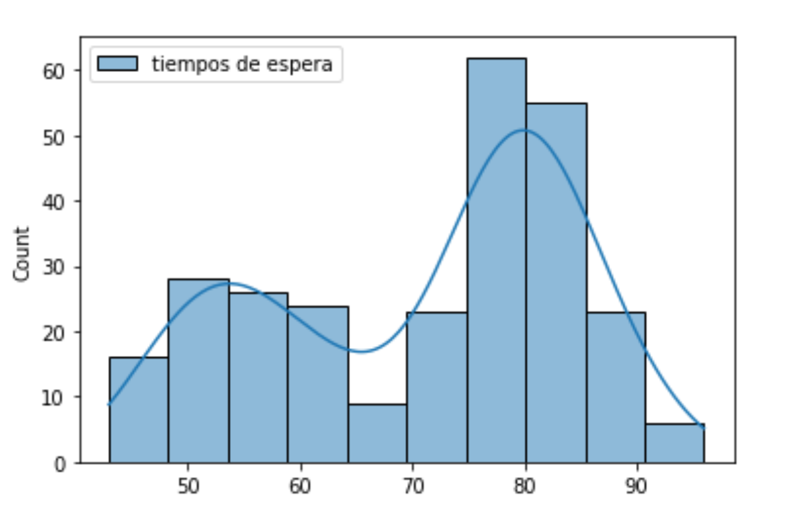
```

---
# KDE  Bandwidth

\begin{align}
  MSE (\hat{f}(x)) = \left( Sesgo (\hat{f}(x))\right)^2 + Var (\hat{f}(x)) 
\end{align}

La expresión aproximada en $x_o$ está dada por 

\begin{align}
  Sesgo [\hat{f} (x_o)] \approx \frac{h^2}{2}  f''(x_o ) \int_{-\infty}^\infty K(\phi) \phi^2  d\phi   
\end{align}


\begin{align}
   Var [\hat{f} (x_o)] \approx \frac{1}{n\times h}  f(x_o ) \int_{-\infty}^\infty K^2(\phi)   d\phi   
\end{align}


---
# KDE
```{r , echo = FALSE, out.width=500, out.height=400, fig.align='center'}
  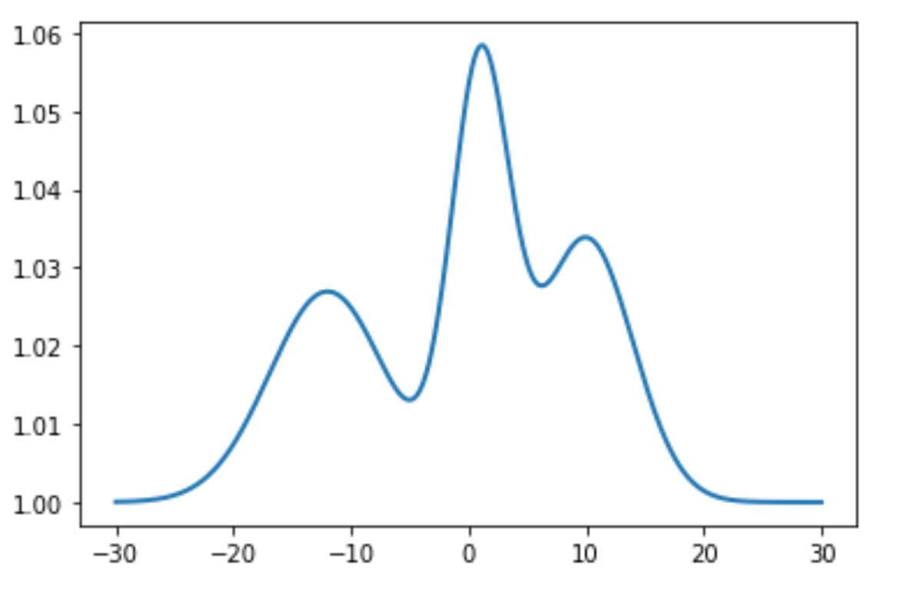
```

---
# KDE
```{r , echo = FALSE, out.width=500, out.height=400, fig.align='center'}
  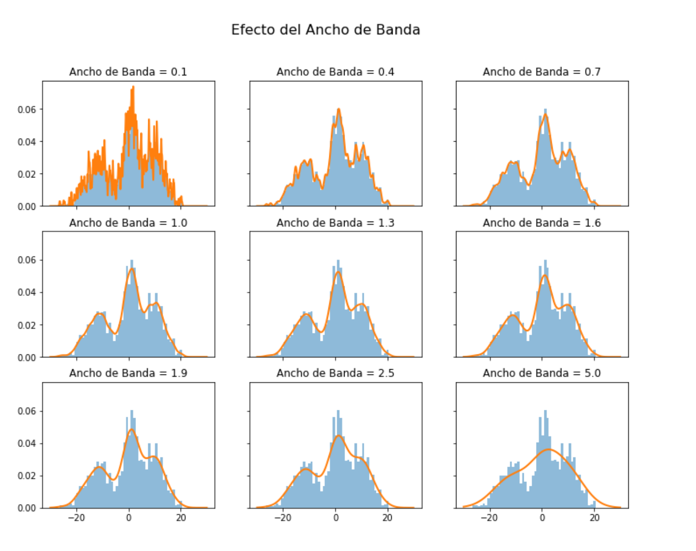
```

---
# KDE  Bandwidth


   - Scott's Rule: $h \approx 1.06⋅\hat{\sigma} n^{−1/5}$. 

   - Silverman: $h \approx 0.9 min \left\{\hat{\sigma}, \frac{IQR}{1.35}\right\} n^{−1/5}$. 
   
   - Cross-Validation:

\begin{align}
CV_k(h) = \frac{1}{n} \sum_{i=1}^n \log \hat{f}_{-k}(X_k)
\end{align}


---
# KDE
```{r , echo = FALSE, out.width=500, out.height=400, fig.align='center'}
  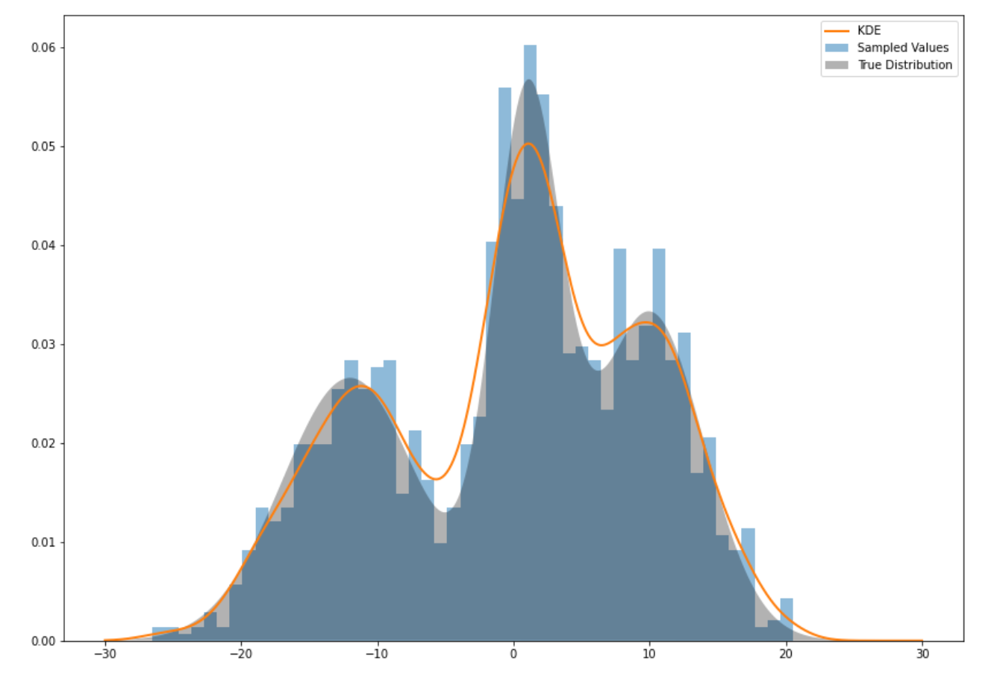
```

---
### KDE: Kernel


Properties

1.  $K(u)=K(-u)$

2.  $\int_{-\infty}^\infty K(u) du = 1$

3. $K'(u)<0$ when $u>0$

4. $E[K]=0$


---
### KDE: Kernel

```{r , echo = FALSE, out.width=500, out.height=400, fig.align='center'}
  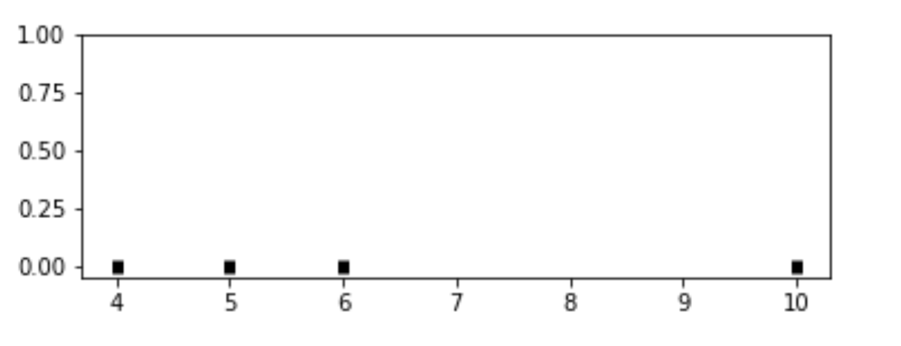
```
---
### KDE: Kernel

```{r , echo = FALSE, out.width=500, out.height=400, fig.align='center'}
  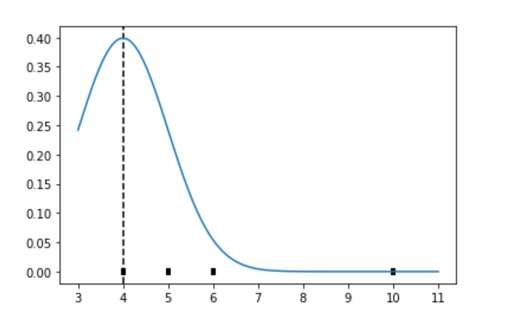
```

---
### KDE: Kernel

```{r , echo = FALSE, out.width=500, out.height=400, fig.align='center'}
  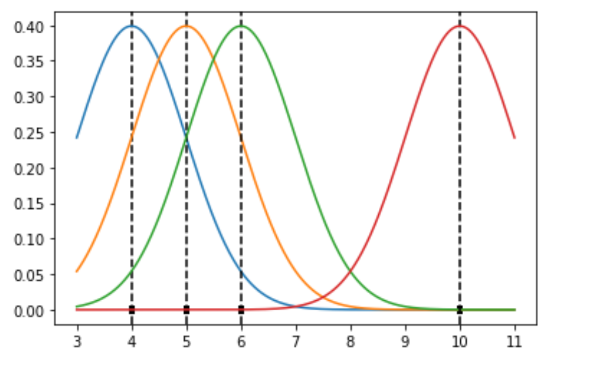
```

---
### KDE: Kernel

```{r , echo = FALSE, out.width=500, out.height=400, fig.align='center'}
  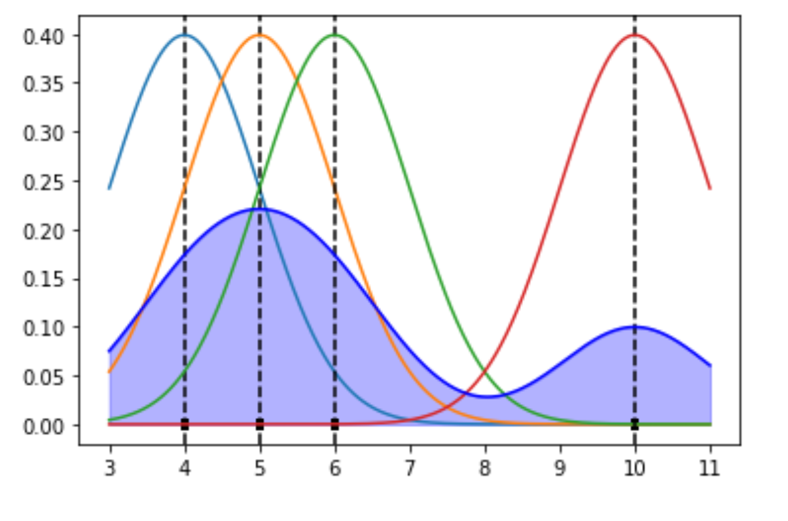
```

---
### KDE: Kernel

Kernel functions:

  - Gaussian 
  
  - Epanechnikov
  
  - Rectangular
  
  - Triangular

---
### KDE: Kernel

```{r , echo = FALSE, out.width=500, out.height=400, fig.align='center'}
  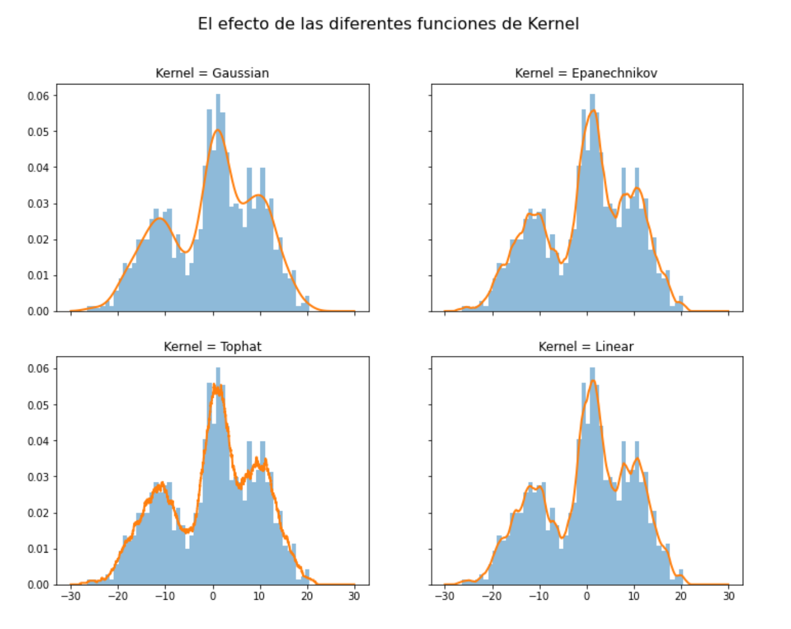
```
---
### KDE: Kernel

```{r}
db<-data.frame(place=c("CBD"),lat=c(4.651887), long=c(-74.05812))
db<-st_as_sf(db,coords=c('long','lat'),crs=4326) #EPSG:4326 - WGS 84, latitude/longitude coordinate system 
db<-st_transform(db, 4686)
z<-st_distance(bars,db)
head(z)
```


---
### KDE: Kernel

```{r}
z<-units::set_units(z,"km")
head(z)
```

---
### KDE: Kernel
```{r}
plot(density(z))
```

---
### KDE: Kernel
```{r}
plot(density(z,bw="nrd0", kernel='gaussian'))
```

---
### KDE: Kernel
```{r}
plot(density(z,bw="nrd0", kernel='epanechnikov'))
```


---
### KDE: Kernel
```{r}
plot(density(z,bw="nrd0", kernel='rectangular'))
```

---
### Bivariate KDE


\begin{align}
\hat{f}(x;H):=\frac{1}{n|H|^{1/2}}\sum_{i=1}^nK\left(H^{-1/2}(\mathbf{x}-\mathbf{x}_i)\right)
\end{align}

\begin{align}
    \hat{f}(x,y) = \frac{1}{nh_xh_y}\sum_{i=1}^n K\left(\frac{X_i-x}{h_x}\right)K\left(\frac{Y_i-x}{h_y}\right)
\end{align}

---
### Bivariate KDE

.pull-left[
```{r plot-label3, eval=FALSE,message=FALSE, warning=FALSE}
ggplot(bars, aes( x=LONGITUD, y=LATITUD) ) +
  geom_density_2d(size = 0.25, colour = "black") +
  theme_bw()
```
]

.pull-right[
```{r plot-label3-out, ref.label="plot-label3", echo=FALSE,message=FALSE, warning=FALSE}
```
]

---
### Bivariate KDE
```{r message=FALSE, warning=FALSE}
require("SpatialKDE")

bars<-st_transform(bars,21818)

cell_size <- 2000
band_width <- 1000

grid_bars <- bars %>% 
  create_grid_rectangular(cell_size = cell_size, side_offset = band_width)
```

---
### Bivariate KDE
```{r message=FALSE, warning=FALSE}
kde <- bars %>% 
  kde(band_width = band_width, kernel = "epanechnikov", grid = grid_bars)
kde
```
---
### Bivariate KDE

.pull-left[
```{r plot-label4, eval=FALSE,message=FALSE, warning=FALSE}
require("tmap")

tm_shape(kde) + 
  tm_polygons(col = "kde_value", palette = "viridis", title = "KDE Estimate") +
  tm_shape(bars) +
  tm_bubbles(size = 0.1, col = "red")
```
]

.pull-right[
```{r plot-label-out, ref.label="plot-label4", echo=FALSE,message=FALSE, warning=FALSE}
```
]

---
```{r info}
sessionInfo()
```

